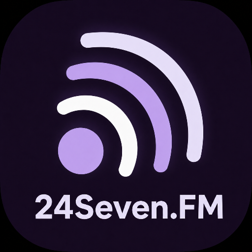

<div align="center">
  
  <h1>24Seven.FM Player</h1>
  <p><strong>Five stations. One adaptive, fully native Android player.</strong></p>
  <p>A community-built Kotlin, Jetpack Compose, and Media3 client for the 24seven.FM internet-radio network.</p>
  <p>
    <a href="https://github.com/James-Jennison/24Seven.FM-Player/actions/workflows/android.yml"></a>
    <a href="https://github.com/James-Jennison/24Seven.FM-Player/actions/workflows/privacy-pages.yml"></a>
    <a href="LICENSE"></a>
  </p>
  <p>
    <a href="https://player.jamesjennison.net/"><strong>Project portal</strong></a> ·
    <a href="https://player.jamesjennison.net/product-testing/"><strong>Test the Player</strong></a> ·
    <a href="https://player.jamesjennison.net/roadmap/"><strong>Interactive roadmap</strong></a> ·
    <a href="https://github.com/James-Jennison/24Seven.FM-Player"><strong>Repository</strong></a>
  </p>
</div>

> [!NOTE]
> This is an unofficial, non-commercial community project. It is not affiliated with or endorsed by 24seven.FM or its stations. The application is fully native and does not use a WebView.

## At a glance

| Platform | Station integrations | Supported runtime | Current target |
| :---: | :---: | :---: | :---: |
| Native Android | **5 certified** | Android 8.0+ | Android 16 / API 36 |

| StreamingSoundtracks.com | 1980s.FM | Adagio.FM | Death.FM | Entranced.FM |
| :---: | :---: | :---: | :---: | :---: |
| Soundtracks | 1980s | Classical | Extreme metal | Trance |

The [comprehensive project portal](https://player.jamesjennison.net/) connects the product experience to its native architecture, development workflow, validation evidence, milestone history, release readiness, and contributor resources. The canonical [privacy notice](https://player.jamesjennison.net/privacy/) has a dedicated stable route.

### Project website development

The website is live as an isolated static Webuzo deployment at
`player.jamesjennison.net`. It requires no application background process.
Docker is the only local build dependency; the build script uses the same
digest-pinned GitHub Pages build image as the repository workflow.

```bash
./scripts/validate-project-site.sh
```

This prepares the canonical privacy notice and artwork, builds `_site/`, validates routes, links, fragments, metadata,
public-content boundaries, and JavaScript syntax, and audits the temporary GitHub Pages transition artifact. Only the
reviewed `_site/` directory is eligible for an approved Webuzo deployment. No script deploys it.

With `_site/` served locally on port 4173, the dependency-free Chromium contract test can be run with:

```bash
node scripts/test-project-site-browser.mjs http://127.0.0.1:4173
node scripts/test-project-site-firefox.mjs http://127.0.0.1:4173
```

The organizational GitHub Pages site remains unchanged unless the separately approved
`PLAYER_PAGES_TRANSITION_APPROVED` repository variable is set to `true` and the Project Site workflow is dispatched or
runs on an approved `main` push. See [the migration and deployment plan](docs/project-site-migration.md).

## Alpha status

The canonical roadmap now runs from **M01 through M60**. **M01–M28 and M31–M35 are complete**, preserving 33 verified achievements. The active Alpha-readiness program is **M29–M35** with two gates still open; authorized closed-app community delivery is **M36–M38**; candidate delivery and publication are **M39–M41**.

> [!IMPORTANT]
> **Current focus:** close M29–M35 without weakening external approval, security, accessibility, signing, or request-integrity gates. M36–M38 cannot begin until an authorized event source exists, and M41 requires explicit publication authorization.

<details>
<summary><strong>Explore the current Alpha capability and validation summary</strong></summary>

The current Alpha provides a responsive native player, service-owned Media3 playback and Sleep Timer, Android-managed audio-output selection, five-station navigation, device-local startup preferences, live metadata and artwork, Queue/History, five isolated station accounts with Android-protected sessions, Chat, song requests, Favorites, verified SST request activity, fixed-recipient Contact handoff, and user-reviewed privacy-safe diagnostics. Request availability is conservatively revalidated against fresh Queue and recent-play data before a one-shot submission, including stable indexed handling for 1,500-track Favorites lists.

Public community content remains behind the adult age screen, versioned Terms acceptance, and separate mature-content reveal. Native report actions prepare bounded, station-scoped email drafts addressed to the monitored moderation contact for user review and explicit sending; Contact Us uses the same fixed-recipient handoff. Station-scoped local block controls are implemented. M27 supplies opt-in exact-name Chat-mention detection only while the existing Chat feed is actively observed; it is not closed-app push. Reliable delivery remains M36–M38 and will not be imitated with perpetual background polling.

The validated baseline includes 163 unit tests, debug lint and release checks, API 26–36 coverage, a 16 KB runtime, Pixel Fold and Tablet layouts, large-text and accessibility checks, network loss/recovery, physical Motorola Razr lifecycle checks, and human TalkBack plus Bluetooth keyboard/pointer acceptance on the signed Razr release. M32 adds a genuine foreign-package controller harness and focused 20/20 Razr security evidence; M33 adds fresh station/account/Queue/readiness request validation, bounded duplicate suppression, and a focused physical-Razr confirmation check; M35 adds a protected current-head signing path, exact upload-certificate verification, and local release clean/update evidence on the Razr. Evidence remains in the milestone documents linked from the [canonical roadmap](docs/ROADMAP.md).

</details>

## Project roadmap

The roadmap was renumbered into one dependency-ordered sequence on July 18, 2026. Historical documents and filenames remain available; the [migration ledger](docs/MILESTONE_MIGRATION.md) records every former identifier.

The public roadmap emphasizes verified outcomes, dependencies, and explicit approval gates. Detailed working estimates
remain project-maintenance material rather than public release promises.

| Phase | Milestones | State | Required outcome |
| --- | --- | :---: | --- |
| Verified product baseline | M01–M28 | ✅ Complete | Native foundation, five certified stations, API/launcher readiness, Sleep Timer, system audio output, diagnostics, local Chat mentions, and validated UGC safeguards |
| Alpha readiness | M29–M35 | 🚧 Active | Play declarations, rights, payments/account lifecycle, security, request integrity, device/accessibility, and signing |
| Community delivery | M36–M38 | ⏳ Authorization-gated | Authorized event source, secure delivery, and lifecycle/privacy certification |
| Alpha delivery | M39–M41 | ⏳ Planned | Candidate freeze, Play-delivered remediation, and explicitly authorized Alpha publication |
| Production readiness | M42–M45 | ⏳ Planned | Closed-test stabilization, production access, staged rollout, and operations |
| Bounded future scope | M46–M60 | 🧊 Planned/deferred | Architecture sustainability, repaired Private Messages, retired Forum scope, Cast feasibility, extended station/account capabilities, and authorized native VIP/RIP commerce |

### Current progression

- **Completed:** M01–M28 and M31–M35. M31 establishes the Contact-only Play boundary and moves any future native VIP/RIP purchase and activation into M58–M60; M32 hardens controller authority, protected sessions, redirects, canonical station IDs, and build integrity; M33 binds every one-shot request to fresh station, account, Queue, readiness, and track identity; M34 accepts adaptive, assistive, and physical alternative-input evidence; M35 proves the protected upload identity, local release install/update lineage, package registration, and version-code eligibility.
- **Active:** two M29–M35 gates remain: M29 and M30. Each milestone has an independent acceptance gate.
- **Authorization-gated:** M36–M38 require an approved station-side event source or privacy-compatible relay before implementation.
- **Publication:** M39–M41 deliberately separate candidate freeze, Play delivery, and the final user-authorized Alpha action.
- **Production:** M42–M45 add stabilization, production-access evidence, staged release, and operational recertification.
- **Deferred/future:** Private Messages remain excluded until M47 repairs and verifies server delivery. M51–M54 are retired by project decision: the Player will not expose, retrieve, or participate in station Forums; the historical research remains retained as evidence. Google Cast remains a feasibility gate at M55, and native VIP/RIP commerce is authorization-gated across M58–M60.
- **Testing:** the [Product Testing catalog](https://player.jamesjennison.net/product-testing/) contains 35 stable test cases covering the current product, Alpha gates, release campaigns, and capability-gated future slices. PT-29–PT-31 were retired with the permanent removal of Forum scope. PT-35 is the exact-artifact M29 Play declaration/privacy/reviewer-access case; PT-36–PT-38 define the future authorized VIP/RIP purchase, activation, and lifecycle evidence.

Use these sources as the current planning authority:

- [Full M01–M60 roadmap](docs/ROADMAP.md)
- [Cumulative milestone time ledger](docs/MILESTONE_TIME_LEDGER.md)
- [Milestone ID migration ledger](docs/MILESTONE_MIGRATION.md)
- [Implementation and acceptance plan](docs/IMPLEMENTATION_PLAN.md)
- [Future-scope boundaries](docs/future-scope.md)
- [Interactive public roadmap](https://player.jamesjennison.net/roadmap/)
- [James-Jennison repository](https://github.com/James-Jennison/24Seven.FM-Player)

The app remains fully native and uses immutable Compose UI state, repository boundaries, and station capability flags. It includes play, pause, stop, live metadata and artwork, a persistent mini-player, signed-in favorite-track browsing/filtering, capability-aware states, and Android Keystore-backed account sessions. Remote data stays bounded to documented station interfaces and approved refresh rules.

## Screenshots

Most captures are from the physical Razr and use live station data, so track and chat content will naturally change over time. The M15 request-activity capture intentionally shows the safe signed-out state after a fresh debug install. The final accessibility and network-recovery pairs are privacy-safe API 35 emulator evidence. The Player and Queue captures show the M11 Alpha shell; Chat and Requests retain their already-working native M08–M10 content presentation. The M16 capture shows the original trusted browser directory, while M17–M21 include station-certification evidence. Screenshot filenames retain their legacy IDs so existing links do not break.

<table>
  <tr>
    <td width="36%" align="center" valign="top"><br><strong>Compact Player</strong><br><sub>Live physical-Razr experience.</sub></td>
    <td width="64%" align="center" valign="top"><br><strong>Expanded Player</strong><br><sub>Responsive two-pane tablet layout.</sub></td>
  </tr>
</table>

<details>
<summary><strong>Open the complete validated screenshot gallery</strong></summary>

<table>
  <tr>
    <td width="50%" align="center" valign="top"><br><strong>Adaptive Player</strong><br><sub>Live artwork, track metadata, station carousel, and playback controls.</sub></td>
    <td width="50%" align="center" valign="top"><br><strong>Queue</strong><br><sub>Upcoming tracks alongside the persistent mini-player.</sub></td>
  </tr>
  <tr>
    <td width="50%" align="center" valign="top"><br><strong>Live Chat</strong><br><sub>Native station-scoped community conversation.</sub></td>
    <td width="50%" align="center" valign="top"><br><strong>Song Requests</strong><br><sub>Multi-field station-library search and request workflow.</sub></td>
  </tr>
  <tr>
    <td width="50%" align="center" valign="top"><br><strong>Favorite Tracks</strong><br><sub>Accessible request availability across large station-owned lists.</sub></td>
    <td width="50%" align="center" valign="top"><br><strong>VIP Request Message</strong><br><sub>Verified requester attribution and message shown in Queue.</sub></td>
  </tr>
  <tr>
    <td width="50%" align="center" valign="top"><br><strong>Independent Accounts</strong><br><sub>Protected, separately visible sessions for each station.</sub></td>
    <td width="50%" align="center" valign="top"><br><strong>Startup Preferences</strong><br><sub>Device-local resume and default-station behavior.</sub></td>
  </tr>
  <tr>
    <td width="50%" align="center" valign="top"><br><strong>Request Activity</strong><br><sub>Request history, cooldown, readiness, and membership state.</sub></td>
    <td width="50%" align="center" valign="top"><br><strong>Trusted Station Content</strong><br><sub>Allowlisted same-station pages opened through a secure browser.</sub></td>
  </tr>
  <tr>
    <td width="50%" align="center" valign="top"><br><strong>M17 SST Certification</strong><br><sub>Certified live Player state and complete native navigation.</sub></td>
    <td width="50%" align="center" valign="top"><br><strong>M18 1980s.FM Certification</strong><br><sub>Verified independent 1980s.FM authentication.</sub></td>
  </tr>
  <tr>
    <td width="50%" align="center" valign="top"><br><strong>M19 Adagio.FM Certification</strong><br><sub>Verified independent Adagio.FM authentication.</sub></td>
    <td width="50%" align="center" valign="top"><br><strong>M20 Death.FM Player</strong><br><sub>Certified sparse-metadata playback and station navigation.</sub></td>
  </tr>
  <tr>
    <td width="50%" align="center" valign="top"><br><strong>Historical Death.FM Page Evidence</strong><br><sub>M20 certification evidence retained for history; the RIP purchase route is not in the current Play catalog.</sub></td>
    <td width="50%" align="center" valign="top"><br><strong>M20 Death.FM Authentication</strong><br><sub>Verified station-isolated Death.FM account session.</sub></td>
  </tr>
  <tr>
    <td width="50%" align="center" valign="top"><br><strong>M21 Entranced.FM Player</strong><br><sub>Certified artwork, metadata, playback, and station selection.</sub></td>
    <td width="50%" align="center" valign="top"><br><strong>M21 Entranced.FM Authentication</strong><br><sub>Verified station-isolated Entranced.FM account session.</sub></td>
  </tr>
  <tr>
    <td width="50%" align="center" valign="top"><br><strong>M23 Compact Layout</strong><br><sub>Physical Razr evidence with live playback and bottom navigation.</sub></td>
    <td width="50%" align="center" valign="top"><br><strong>M23 Expanded Layout</strong><br><sub>Landscape two-pane Player with navigation rail and station carousel.</sub></td>
  </tr>
  <tr>
    <td width="50%" align="center" valign="top"><br><strong>M23 Large-Text Player</strong><br><sub>2× text and enlarged-display compact layout with reachable controls and station details.</sub></td>
    <td width="50%" align="center" valign="top"><br><strong>M23 Large-Text Account</strong><br><sub>Account identity and status reflow instead of competing for one narrow row.</sub></td>
  </tr>
  <tr>
    <td width="50%" align="center" valign="top"><br><strong>M23 Offline State</strong><br><sub>Clear waiting status after both live-stream variants fail without connectivity.</sub></td>
    <td width="50%" align="center" valign="top"><br><strong>M23 Automatic Recovery</strong><br><sub>Expanded Player returned to live playback after validated connectivity was restored.</sub></td>
  </tr>
  <tr>
    <td width="50%" align="center" valign="top"><br><strong>M24 Timer Setup</strong><br><sub>Accessible presets and a bounded 1–720 minute custom duration.</sub></td>
    <td width="50%" align="center" valign="top"><br><strong>M24 Active Countdown</strong><br><sub>Service-published remaining time during live playback.</sub></td>
  </tr>
  <tr>
    <td colspan="2" align="center" valign="top"><br><strong>M25 Audio-Output Handoff</strong><br><sub>Android System UI and the native Player agree on the active Bluetooth route.</sub></td>
  </tr>
</table>

</details>

Audio stream addresses come from station-provided playlists and remain subject to device verification. Remote interfaces are added only after source verification and permission review. See the milestone research and validation documents under [docs](docs) for authorization, protocol evidence, limits, and device results.

M17 tracks the native Private Messages experience, which remains deferred until the website's underlying server issues and production behavior are settled. See [docs/future-scope.md](docs/future-scope.md).

Alpha testers and distributors should read [the privacy notice](PRIVACY.md), [Alpha testing guide](docs/alpha-testing.md), [release notes](docs/releases/0.1.0-alpha01.md), [Play Console checklist](docs/play-console-checklist.md), and [M23 signing handoff](docs/m23-alpha-readiness.md). Development debug APKs are not intended for external distribution.

## Building

Open the repository in a current Android Studio release with JDK 17. The project targets and compiles against Android 16 (API 36), and is currently validated on the primary Motorola Razr 2023 running Android 16. It supports Android 8.0 (API 26) and newer.

From PowerShell, validate the project with:

```powershell
.\gradlew.bat testDebugUnitTest lintDebug assembleRelease
```

For an Ubuntu Codex CLI and Android Studio workstation, install the pinned
project toolchain, both API 35/API 36 emulators, and persistent `ANDROID_HOME`
configuration with:

```bash
bash scripts/bootstrap-ubuntu.sh --accept-licenses
```

The script also installs the ChatGPT Codex CLI. Authenticate afterward with
`codex login`, or use `codex login --device-auth` on a headless host. See the
[Ubuntu development setup](docs/ubuntu-cli-setup.md) for installed components,
options, security boundaries, and verification commands.

If the repository is inside a OneDrive-synced directory and Gradle stalls on file operations, direct app build outputs to a local directory before running Gradle:

```powershell
$env:TWENTYFOURSEVEN_ANDROID_BUILD_DIR="$env:TEMP\24seven-android-build"
```

See [CONTRIBUTING.md](CONTRIBUTING.md) before contributing.

For migration to another Windows development machine, clone the repository, install JDK 17 plus Android SDK Platform
36 and Build Tools 36.1.0, then run
`powershell.exe -NoProfile -ExecutionPolicy Bypass -File .\scripts\validate-windows.ps1`. The current Ubuntu workflow
is documented in the [Ubuntu development setup](docs/ubuntu-cli-setup.md).
