# 24Seven.FM Player

An unofficial, community-built native Android client for the 24seven.FM internet-radio network.

The application is written in Kotlin with Jetpack Compose and Jetpack Media3. It does not use a WebView and is not affiliated with or endorsed by 24seven.FM or its stations.

[Comprehensive project portal](https://codeframe78.github.io/24Seven.FM-Player/project/) · [Live build dashboard](https://github.com/users/codeframe78/projects/1) · [Privacy notice](https://codeframe78.github.io/24Seven.FM-Player/)

The project portal documents the product experience, native architecture, development workflow, validation evidence, chronological milestone history, release readiness, and contribution resources.

## Supported stations

- StreamingSoundtracks.com
- 1980s.FM
- Adagio.FM
- Death.FM
- Entranced.FM

## Alpha status

Milestones M1–M16, M18–M22, M24–M26, and the M27.1 local notification foundation are complete in project history. M17 Private Messages remains deferred for legacy server repair. All five station-certification gates now pass; the expanded M23 Play-testing readiness program is in progress, M27.2 reliable background delivery remains the final pre-Alpha feature slice, and publication is M28.

The current Alpha provides a responsive native player, service-owned Media3 playback, a service-owned Sleep Timer, native Android audio-output selection with visible current-route state, five-station navigation, device-local startup/last-station preferences, live metadata and artwork, queue/history, an independent five-station account dashboard with Android-protected sessions, chat, song requests, signed-in favorite-track browsing, a verified SST request-history/cooldown/membership surface, a trusted browser directory for selected public station content, and user-reviewed in-app diagnostics. The diagnostics flow uses a fixed privacy allowlist, bounds recent enum-only transitions, reduces errors and audio routes to broad categories, and requires an explicit Copy or Share action. The timer offers presets/custom duration, live remaining time, adjust/cancel actions, service recreation, and deterministic playback stop at expiry; compatible system media surfaces receive an active-timer cancellation command. The output control opens Android's system route surface for phone, Bluetooth, wired/USB, and other system-managed outputs without adding a relay or unverified stream URL; Google Cast remains capability-gated. The media notification body reopens the existing player task, station-library search supports title/album/artist/genre, Library results can be sorted by station order or play state, and Favorites can be sorted by number, track name, album, artist, genre, year, length, or play state. Request availability is conservatively revalidated against fresh station and Queue data before submission, with indexed and stable-state resolution keeping a full 1,500-track VIP/RIP Favorites list responsive; requests sent from Favorites now show the station's success, rejection, or indeterminate-confirmation result without leaving the list. Public community content is now hidden behind an adult age screen, versioned Terms acceptance, and a separate mature-content reveal, with native report-content/report-user/block-user actions and station-scoped local block management. M27.1 adds opt-in, station-scoped exact-name Chat-mention detection, first-snapshot baselining, duplicate suppression, blocked-author filtering, privacy-minimized Android alerts, and safety-gated Chat navigation while the existing Chat feed is actively observed; true closed-app push remains pending an authorized event source. Navigation, Player station cards, and account headers reflow at Android's 2× text setting with an enlarged display while preserving explicit destination semantics. An offline terminal playback failure now presents a clear waiting state and performs one automatic Media3 prepare when validated connectivity returns; pause, stop, or a station change cancels that recovery. All 146 unit tests, debug lint, release bundle checks, the current focused 2/2 M27.1 physical-Razr connected checks, the prior 40/40 connected suite on the API 35 Pixel Tablet at normal settings, the prior 39/39 suite at maximum tested accessibility settings, prior 36/36 connected suites on API 26, API 36, the API 35 16 KB runtime, Pixel Fold open, and Pixel Tablet landscape, focused current-head phone/Fold/accessibility checks, the focused M24–M26 physical Razr checks, live phone and Tablet network cut/restore cycles, the earlier 21/21 physical Razr suite, Windows validation, and a complete physical Razr open/tabletop/closed/reopened playback cycle are green. Startup, memory, and large-Favorites diagnostics are recorded in [the M23 performance validation](docs/m23-performance-validation.md), with the adaptive device contract in [the M23 compatibility matrix](docs/m23-device-compatibility.md), timer evidence in [the M24 validation](docs/m24-sleep-timer-validation.md), route evidence in [the M25 validation](docs/m25-audio-output-validation.md), support-snapshot evidence in [the M26 validation](docs/m26-diagnostics-validation.md), and local mention evidence in [the M27.1 validation](docs/m27-community-notification-validation.md).

## Project Roadmap

This roadmap separates the order work was actually completed from the stable milestone IDs used for requirements and evidence. The achievement history below is chronological and authoritative; detailed completion gates, estimates, dependencies, and confidence risks are maintained in [the implementation plan](docs/IMPLEMENTATION_PLAN.md).

### Current progression

- **Completed:** M1–M16, all five station certifications (M18–M22), M23.3 Android 16 / API 36 readiness, M23.7 adaptive launcher/store polish, M24 Sleep Timer, M25 Audio-Output Selection, and M26 In-App Diagnostics.
- **Active:** M23 Play-testing readiness, with 2 of 7 reviewable sub-milestones complete.
- **Active focus:** M23.2 UGC safety and moderation. Administrator authorization is recorded and the [native implementation](docs/m23-ugc-safety-validation.md) is test-green; completion is waiting only for confirmation that the single harmless report reached the moderator inbox and reconciliation of that server response.
- **Remaining release gates:** M23.1 per-app Console confirmation, version-code eligibility, and Play-delivered validation after its [protected current-head build and Android developer-verification confirmation](docs/m23-release-candidate-audit.md), M23.2 report-receipt reconciliation, M23.4 Play declarations, M23.5 rights evidence, and M23.6 human audible TalkBack review plus Play delivery/update and pre-launch coverage; then M27.2 true Community Push Notifications and the explicitly authorized M28 Alpha publication.
- **Deferred:** M17 Private Messages remains excluded from the shipping build until the reproduced server-side delivery failure is repaired and verified.
- **Pre-Alpha features:** M24's service-owned Sleep Timer, M25's dedicated Android audio-output path, and M26's privacy-safe in-app diagnostics are complete. M25 intentionally leaves Google Cast gated behind verified receiver compatibility and permitted stream use. M27.1's local Chat-mention foundation is complete for the actively observed Chat feed; M27 still requires an authorized event source for reliable closed-app push and will also support new Private Messages whenever M17 is repaired and enabled, without exposing a broken PM surface or imitating push with perpetual background polling.
- **Project documentation:** The GitHub Pages [project portal](https://codeframe78.github.io/24Seven.FM-Player/project/) now connects the product, architecture, development process, testing evidence, a structured [product-testing workspace](https://codeframe78.github.io/24Seven.FM-Player/project/product-testing/), roadmap, and contributor resources while preserving the canonical privacy-policy URL ([validation and screenshots](docs/project-portal-validation.md)).

### Completed milestones — actual achievement order

The sequence number is the order in which Git history and milestone evidence show the work reaching its completion gate. M11 and M12 closed together in one checkpoint. M17 is absent from this table because it remains deferred rather than completed.

| Achieved | Date | Milestone | Evidence | Outcome |
| ---: | --- | --- | --- | --- |
| 1 | 2026-07-12 | M1 Buildable baseline | [`9184afd`](https://github.com/codeframe78/24Seven.FM-Player/commit/9184afd) | Native Gradle/Compose baseline and Windows build path |
| 2 | 2026-07-13 | M2 Five-station playback | [`5cdade0`](https://github.com/codeframe78/24Seven.FM-Player/commit/5cdade0) | Verified streams, atomic switching, and fallback |
| 3 | 2026-07-13 | M3 Background/system media | [`4206fee`](https://github.com/codeframe78/24Seven.FM-Player/commit/4206fee) | Service-owned playback, MediaSession, focus, and route controls |
| 4 | 2026-07-13 | M4 Now playing | [`0d9e6b3`](https://github.com/codeframe78/24Seven.FM-Player/commit/0d9e6b3) | Live ICY metadata and station artwork |
| 5 | 2026-07-13 | M5 Native navigation | [`8133695`](https://github.com/codeframe78/24Seven.FM-Player/commit/8133695) | Adaptive native destinations and mini-player |
| 6 | 2026-07-13 | M6 Queue and history | [`3babdf9`](https://github.com/codeframe78/24Seven.FM-Player/commit/3babdf9) | Bounded station-scoped Queue/History polling |
| 7 | 2026-07-13 | M7 Authentication | [`a897794`](https://github.com/codeframe78/24Seven.FM-Player/commit/a897794) | Native station login and protected sessions |
| 8 | 2026-07-13 | M8 Chat | [`f99635d`](https://github.com/codeframe78/24Seven.FM-Player/commit/f99635d) | Native memory-only station chat |
| 9 | 2026-07-13 | M9 Song requests | [`e748f27`](https://github.com/codeframe78/24Seven.FM-Player/commit/e748f27) | Native search, confirmation, and one-shot submission |
| 10 | 2026-07-14 | M10 Request attribution/messages | [`73a0d89`](https://github.com/codeframe78/24Seven.FM-Player/commit/73a0d89) | Queue attribution and verified SST request messages |
| 11 (joint) | 2026-07-14 | M11 Adaptive Alpha UI | [`4735f13`](https://github.com/codeframe78/24Seven.FM-Player/commit/4735f13) | Responsive branded UI, previews, accessibility, and exit flow |
| 12 (joint) | 2026-07-14 | M12 Queue-aware request availability | [`4735f13`](https://github.com/codeframe78/24Seven.FM-Player/commit/4735f13) | Conservative station-scoped availability and fresh pre-submit checks |
| 13 | 2026-07-14 | M13 Independent Accounts UX | [`9ef1f1c`](https://github.com/codeframe78/24Seven.FM-Player/commit/9ef1f1c) | Five separately visible account states with session isolation |
| 14 | 2026-07-14 | M14 Local personalization | [`81c2c4e`](https://github.com/codeframe78/24Seven.FM-Player/commit/81c2c4e) | Default/last-station preferences separated from station-owned data |
| 15 | 2026-07-14 | M15 Request history and membership | [`b19d5fe`](https://github.com/codeframe78/24Seven.FM-Player/commit/b19d5fe) | SST request history, cooldown/readiness, and membership state |
| 16 | 2026-07-14 | M16 Secondary content access | [`90a7f98`](https://github.com/codeframe78/24Seven.FM-Player/commit/90a7f98) | Allowlisted same-station HTTPS Custom Tabs |
| 17 | 2026-07-14 | M18 StreamingSoundtracks.com certification | [`02dffa2`](https://github.com/codeframe78/24Seven.FM-Player/commit/02dffa2) | VIP/non-admin, Queue, request message, Favorites, chat, and authenticated coverage |
| 18 | 2026-07-15 | M19 1980s.FM certification | [`11f1ee3`](https://github.com/codeframe78/24Seven.FM-Player/commit/11f1ee3) | Independent authenticated workflows and station behavior certified |
| 19 | 2026-07-15 | M20 Adagio.FM certification | [`5e985ae`](https://github.com/codeframe78/24Seven.FM-Player/commit/5e985ae) | Classical metadata and authenticated workflows certified |
| 20 | 2026-07-15 | M21 Death.FM certification | [`6757680`](https://github.com/codeframe78/24Seven.FM-Player/commit/6757680) | Compact Queue, sparse metadata, RIP boundaries, and authenticated workflows certified |
| 21 | 2026-07-15 | M22 Entranced.FM certification | [`1e20eea`](https://github.com/codeframe78/24Seven.FM-Player/commit/1e20eea) | Extended Queue, legacy ICY punctuation, and authenticated workflows certified |
| 22 | 2026-07-15 | M23.3 Android 16 / API 36 readiness | [`44632f1`](https://github.com/codeframe78/24Seven.FM-Player/commit/44632f1) | Target API 36 migration and device regression coverage |
| 23 | 2026-07-15 | M23.7 Adaptive launcher/store polish | [`924a38c`](https://github.com/codeframe78/24Seven.FM-Player/commit/924a38c) | Legacy, adaptive, and monochrome launcher resources validated |
| 24 | 2026-07-16 | M24 Sleep Timer | [`b713783`](https://github.com/codeframe78/24Seven.FM-Player/commit/b713783) | Service-owned presets/custom countdown, restoration, system state, and deterministic expiry ([validation](docs/m24-sleep-timer-validation.md)) |
| 25 | 2026-07-16 | M25 Cast / Audio-Output Selection | [`183ccc0`](https://github.com/codeframe78/24Seven.FM-Player/commit/183ccc0) | Native Android output chooser, accurate current-route state, phone/Bluetooth handoff and recovery, and an explicit capability-gated Cast boundary ([validation](docs/m25-audio-output-validation.md)) |
| 26 | 2026-07-16 | M26 In-App Diagnostics | [`7aedbfc`](https://github.com/codeframe78/24Seven.FM-Player/commit/7aedbfc) | User-reviewed fixed-allowlist snapshot, bounded transitions, explicit Android copy/share, and physical-Razr privacy validation ([validation](docs/m26-diagnostics-validation.md)) |

### Deferred milestone

| Milestone | Size | Status | Current boundary |
| --- | --- | --- | --- |
| M17 Private Messages | L provisional | 🧊 Deferred | Inbox and Sent Box discovery succeeded, but New Message selection remains suspect and a profile-originated MorgHubby test was not delivered; the site owner has the reproduced result |

### Active distribution and planned feature roadmap

| Milestone | Size | Estimate | Status | Outcome |
| --- | --- | --- | --- | --- |
| M23 Play-testing readiness program | XL, split below | 3–6 focused days plus owner/external input | 🚧 In progress | Preserve the completed distribution preparation while closing release-artifact, UGC, API 36, review, rights, device, and launcher-quality gates as separate reviewable milestones |
| M24 Sleep Timer | M | 3–5 hours | ✅ Complete ([evidence](docs/m24-sleep-timer-validation.md)) | Service-owned countdown with presets/custom duration, visible remaining time, adjust/cancel, system cancellation state, restoration, and deterministic expiry |
| M25 Cast / Audio-Output Selection | M | 35–55 minutes | ✅ Complete ([evidence](docs/m25-audio-output-validation.md)) | Android's native output switcher and current-route state cover system-managed device, Bluetooth, wired/USB, and supported remote routes; Google Cast remains gated because receiver compatibility and permitted use are not verified |
| M26 In-App Diagnostics | M | 4–7 hours | ✅ Complete ([evidence](docs/m26-diagnostics-validation.md)) | User-reviewed fixed-allowlist snapshot with bounded state/error/network/output categories and explicit Android copy/share; no account/community/report content, endpoints, route names, identifiers, raw errors, or logs |
| M27 Community Push Notifications | L, split | 6–12 hours total plus delivery authorization | 🚧 M27.1 local foundation complete ([evidence](docs/m27-community-notification-validation.md)) | Opt-in station controls, exact signed-in-name matching, first-snapshot baseline, blocked-user filtering, duplicate suppression, privacy-minimized Android notifications, and safety-gated Chat navigation are implemented for actively observed Chat; M27.2 true background push and future PM delivery remain gated on an authorized event source |
| M28 Alpha publication | M | 1–3 hours after all prior gates | ⏳ Planned after M27 | Revalidate the signed candidate, declarations, device coverage, and Play delivery, then publish the explicitly authorized internal/closed test release |

#### M23 workstreams

The IDs below are stable requirement identifiers, not an implied completion order. Only M23.3 and M23.7 have reached their full completion gates; the other rows record partial checkpoints and remaining dependencies.

| Milestone | Size | Codex estimate | Status | Required outcome |
| --- | --- | --- | --- | --- |
| M23.1 Current-head signed release candidate | M | 2–4 hours | 🚧 Protected Linux build, signer verification, and developer-verification email confirmation green; Play delivery pending ([evidence](docs/m23-release-candidate-audit.md)) | Commit `2086ab9` produced a signed AAB/APK from the authenticated recovery package entirely through the memory-backed Linux path; exact upload-certificate identity, release audit, dependencies/notices, backup exclusions, and 16 KB packaging pass. Google's July 16 notice confirms automatic Android developer-verification registration; confirm per-app Console status and version-code availability, then validate Play delivery/update |
| M23.2 UGC safety and moderation | L, split into research and implementation | 6–12 hours after station input | 🚧 Implementation green; receipt pending ([evidence](docs/m23-ugc-safety-validation.md)) | Authorized native age/Terms/reveal gates, separate report and block actions, local block management, privacy boundaries, and duplicate-safe indeterminate delivery are implemented; administrator receipt confirmation remains |
| M23.3 Android 16 / API 36 readiness | M | 2–4 hours | ✅ Complete ([evidence](docs/m23-api36-readiness.md)) | Targets API 36; 117 unit tests, lint/release bundle, 27/27 API 36 connected tests, and cold-launch/two-Back visual inspection pass |
| M23.4 Play review declarations | M | 2–4 hours plus owner input | 🚧 Local packet and video rehearsal prepared ([evidence](docs/m23-play-declaration-packet.md)) | Accurate listing, copy-ready foreground-service/reviewer instructions, and a frame-inspected notification video rehearsal are prepared; reusable reviewer credentials, final signed-candidate video/link, content-rating answers, station retention, and Console submission remain owner-controlled |
| M23.5 Brand and content-rights evidence | S | 1–2 hours plus external confirmation | 🚧 Request packet prepared ([owner response packet](docs/m23-owner-response-packet.md)) | Copy-ready authorization scope and private/sanitized evidence handling are defined for app/station names, logos, artwork/metadata, authorized stream access, screenshots, and Google Play testing/distribution; authorized written confirmation remains |
| M23.6 Release device matrix and pre-launch report | M | 3–6 hours | 🚧 Local accessibility/network/performance/device checkpoints green ([evidence](docs/m23-device-compatibility.md)) | Emulator coverage passes across minimum API, API 36, 16 KB, Fold, and Tablet states; large-text reflow, real TalkBack service traversal, one-shot network restoration, 1,500-track Favorites performance, and physical Razr hinge testing pass. Human audible TalkBack review, Play delivery/update, and Play pre-launch results remain |
| M23.7 Adaptive launcher/store polish | S | 1–2 hours | ✅ Complete ([evidence](docs/m23-launcher-polish.md)) | Preserves the established logo in density-specific legacy and masked adaptive icons, adds an Android 13 monochrome layer, and revalidates the existing store assets |

M23 is active on this branch. The Google Play developer account and app record are established, Play App Signing is selected, and Google's July 16 account notice confirms that the account's Play apps were automatically registered for Android developer verification; per-app Console status still needs confirmation. The no-ads/non-government/no-financial/no-health declarations are saved, the public [privacy notice](https://codeframe78.github.io/24Seven.FM-Player/) is live and recorded in Console, and the public support email plus Music & Audio category are saved. The owner selected an 18+ target audience consistent with the adult legacy-station community and existing freeform chat; Console entry remains locked behind reviewer-access setup. Play-ready graphics and device screenshots are prepared; compact/medium/expanded layouts, 2× text and enlarged-display reflow, one-shot playback recovery after validated network restoration, genuine emulator fold/tablet states, the physical Razr hinge cycle, notification-to-app navigation, multi-field library search, play-state sorting, full-list Favorites responsiveness, 16 KB runtime, and API 36 targeting are validated. Android CI uses the official Node 24-compatible checkout, Java, and Gradle action generations while retaining the open-source basic Gradle cache provider. Protected upload signing and recovery are green, and the current product candidate has now been rebuilt on Ubuntu with its exact upload-certificate identity verified; version-code eligibility and Play delivery remain. M23.2 now has administrator authorization plus native age/Terms/reveal gates, separate report-content/report-user/block-user actions, and station-scoped block management; its only open implementation evidence is reconciling the single harmless report with the administrator inbox. Foreground-service evidence, explicit brand/content rights, reviewer credentials, final audience/content/Data Safety declarations, tester setup, Play delivery/pre-launch results, and explicit publication authorization also remain gates. M17 Private Messages is not shipped and does not block Alpha testing.

The app is fully native and uses immutable Compose UI state, repository boundaries, and station capability flags. It includes play, pause, stop, live metadata and artwork, a persistent mini-player, signed-in favorite-track browsing/filtering, capability-aware screens, native loading/error/empty states, and Android Keystore-backed account sessions. Remote data stays bounded to the documented station interfaces and their approved refresh rules.

## Screenshots

Most captures are from the physical Razr and use live station data, so track and chat content will naturally change over time. The M15 request-activity capture intentionally shows the safe signed-out state after a fresh debug install. The final accessibility and network-recovery pairs are privacy-safe API 35 emulator evidence. The Player and Queue captures show the M11 Alpha shell; Chat and Requests retain their already-working native M8–M10 content presentation. The M16 capture shows the original trusted browser directory, while M18–M22 include station-certification evidence.

<table>
  <tr>
    <td width="50%" align="center" valign="top">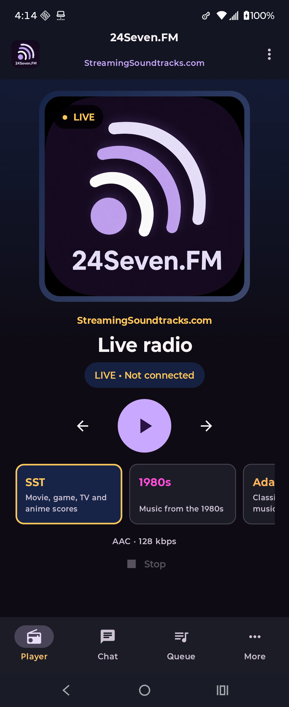<br><strong>Adaptive Player</strong><br><sub>Live artwork, track metadata, station carousel, and playback controls.</sub></td>
    <td width="50%" align="center" valign="top">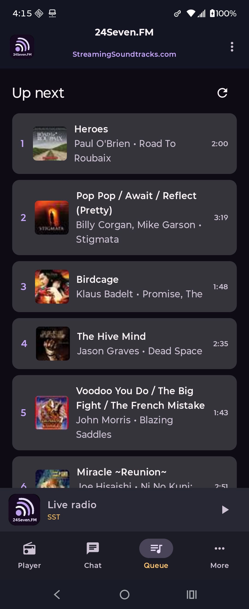<br><strong>Queue</strong><br><sub>Upcoming tracks alongside the persistent mini-player.</sub></td>
  </tr>
  <tr>
    <td width="50%" align="center" valign="top">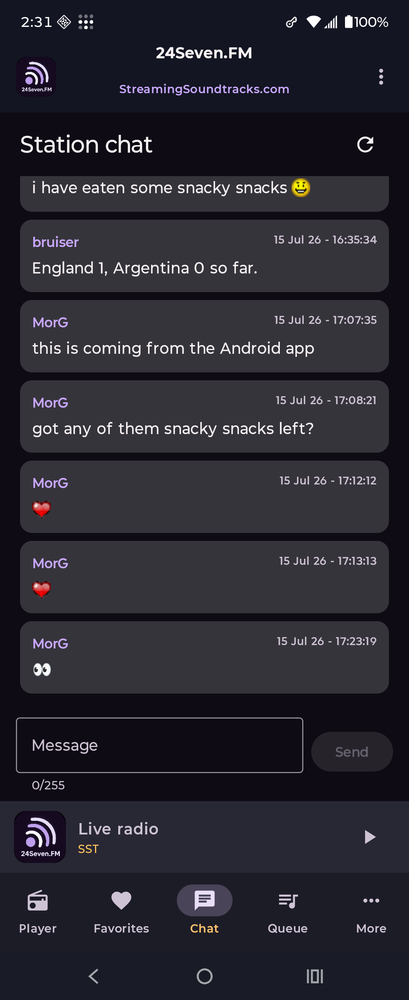<br><strong>Live Chat</strong><br><sub>Native station-scoped community conversation.</sub></td>
    <td width="50%" align="center" valign="top">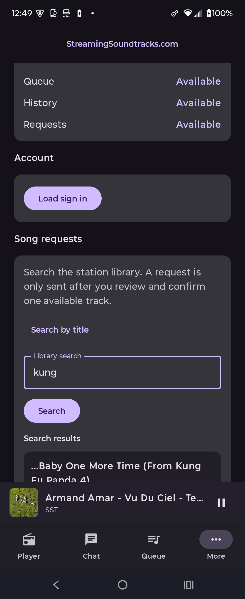<br><strong>Song Requests</strong><br><sub>Multi-field station-library search and request workflow.</sub></td>
  </tr>
  <tr>
    <td width="50%" align="center" valign="top">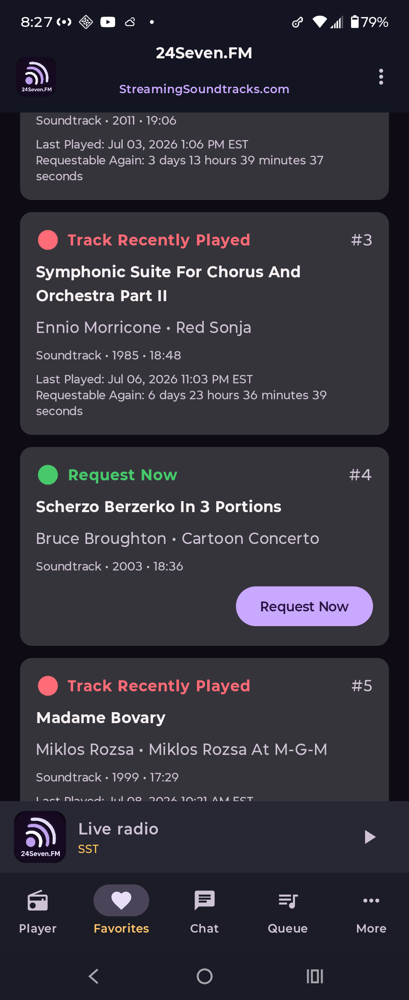<br><strong>Favorite Tracks</strong><br><sub>Accessible request availability across large station-owned lists.</sub></td>
    <td width="50%" align="center" valign="top">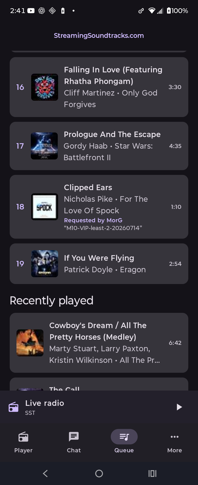<br><strong>VIP Request Message</strong><br><sub>Verified requester attribution and message shown in Queue.</sub></td>
  </tr>
  <tr>
    <td width="50%" align="center" valign="top">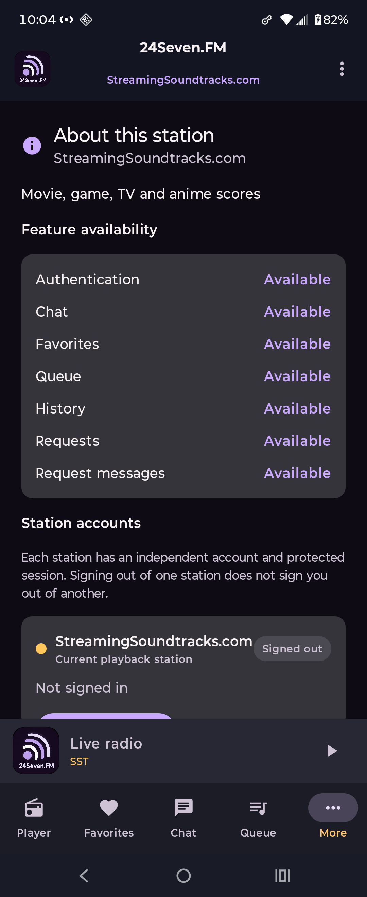<br><strong>Independent Accounts</strong><br><sub>Protected, separately visible sessions for each station.</sub></td>
    <td width="50%" align="center" valign="top">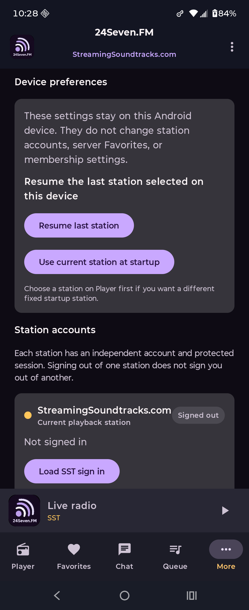<br><strong>Startup Preferences</strong><br><sub>Device-local resume and default-station behavior.</sub></td>
  </tr>
  <tr>
    <td width="50%" align="center" valign="top">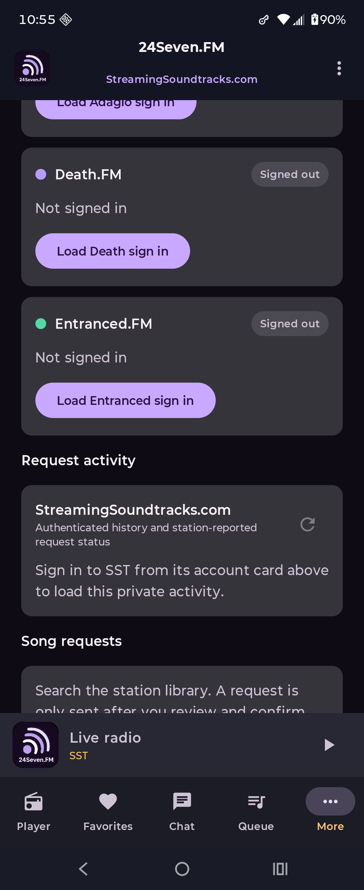<br><strong>Request Activity</strong><br><sub>Request history, cooldown, readiness, and membership state.</sub></td>
    <td width="50%" align="center" valign="top"><br><strong>Trusted Station Content</strong><br><sub>Allowlisted same-station pages opened through a secure browser.</sub></td>
  </tr>
  <tr>
    <td width="50%" align="center" valign="top">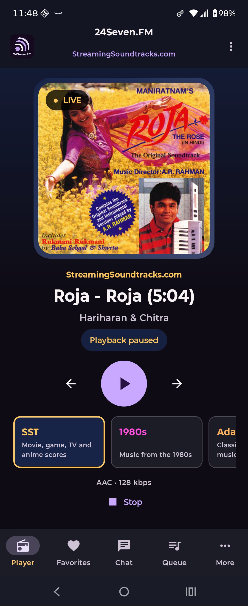<br><strong>M18 SST Certification</strong><br><sub>Certified live Player state and complete native navigation.</sub></td>
    <td width="50%" align="center" valign="top">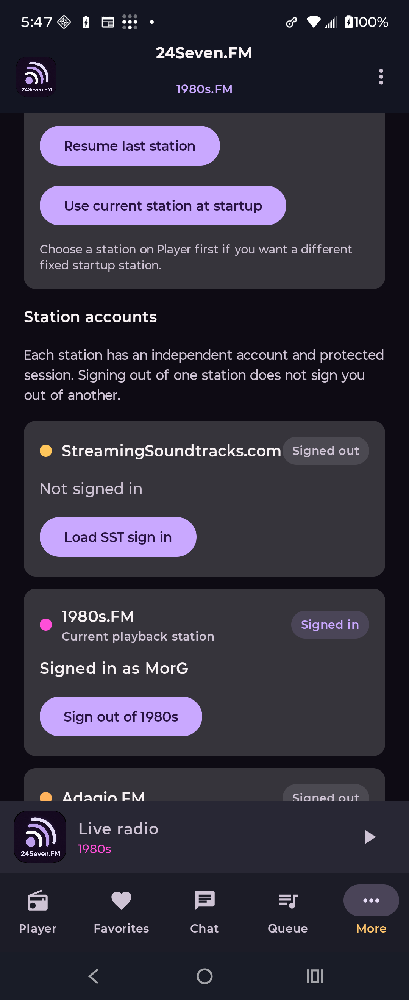<br><strong>M19 1980s.FM Certification</strong><br><sub>Verified independent 1980s.FM authentication.</sub></td>
  </tr>
  <tr>
    <td width="50%" align="center" valign="top">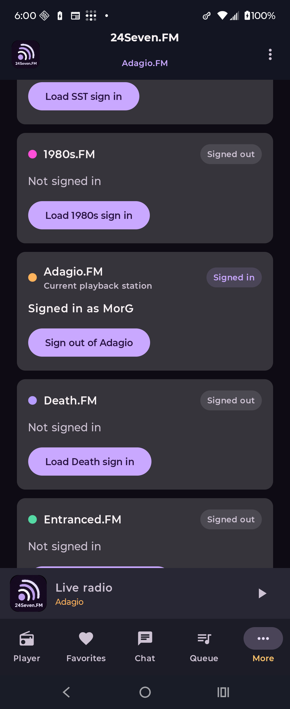<br><strong>M20 Adagio.FM Certification</strong><br><sub>Verified independent Adagio.FM authentication.</sub></td>
    <td width="50%" align="center" valign="top">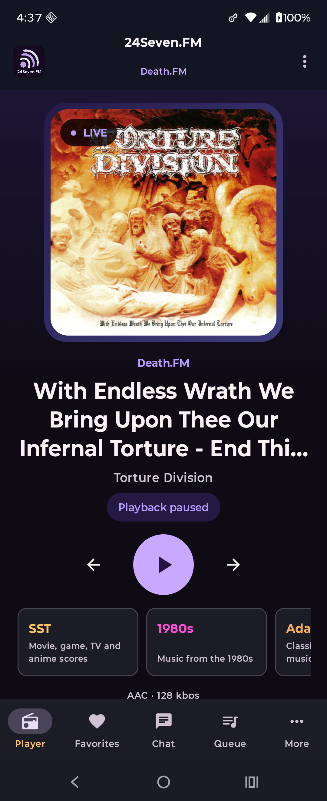<br><strong>M21 Death.FM Player</strong><br><sub>Certified sparse-metadata playback and station navigation.</sub></td>
  </tr>
  <tr>
    <td width="50%" align="center" valign="top">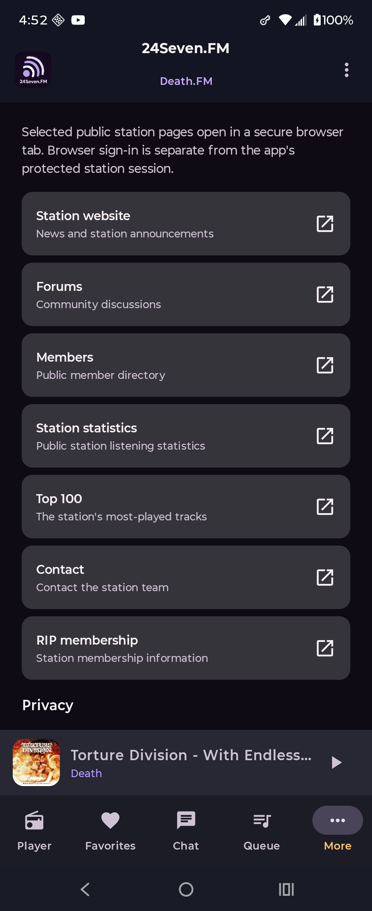<br><strong>Death.FM RIP Pages</strong><br><sub>Trusted station pages and RIP membership access.</sub></td>
    <td width="50%" align="center" valign="top">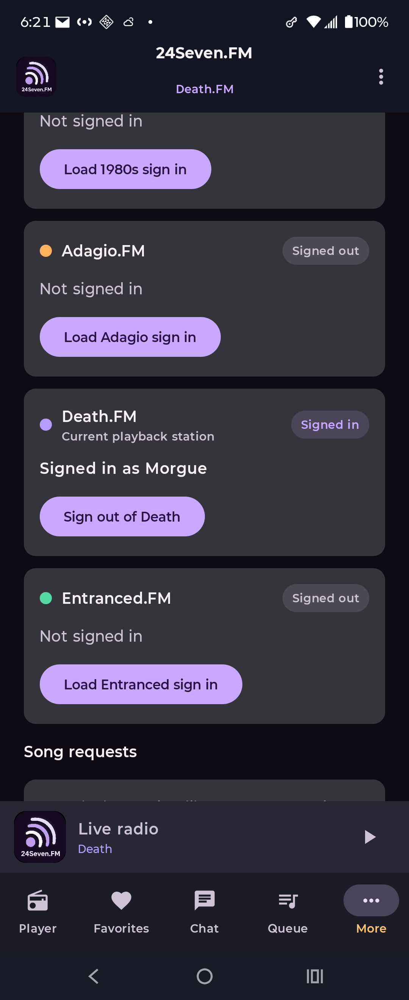<br><strong>M21 Death.FM Authentication</strong><br><sub>Verified station-isolated Death.FM account session.</sub></td>
  </tr>
  <tr>
    <td width="50%" align="center" valign="top">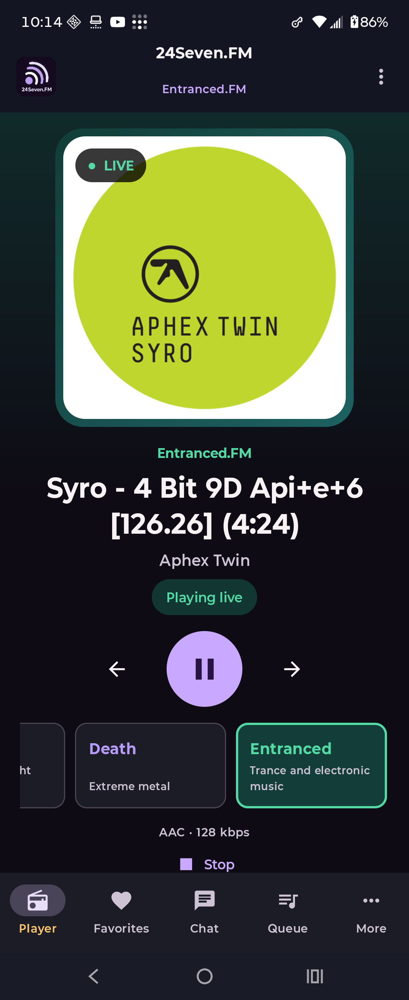<br><strong>M22 Entranced.FM Player</strong><br><sub>Certified artwork, metadata, playback, and station selection.</sub></td>
    <td width="50%" align="center" valign="top">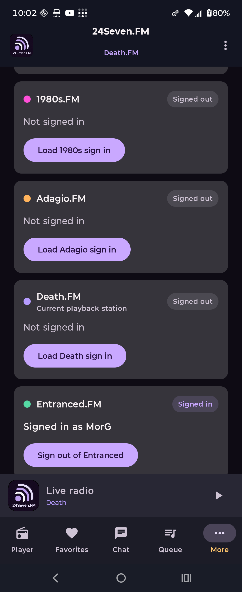<br><strong>M22 Entranced.FM Authentication</strong><br><sub>Verified station-isolated Entranced.FM account session.</sub></td>
  </tr>
  <tr>
    <td width="50%" align="center" valign="top">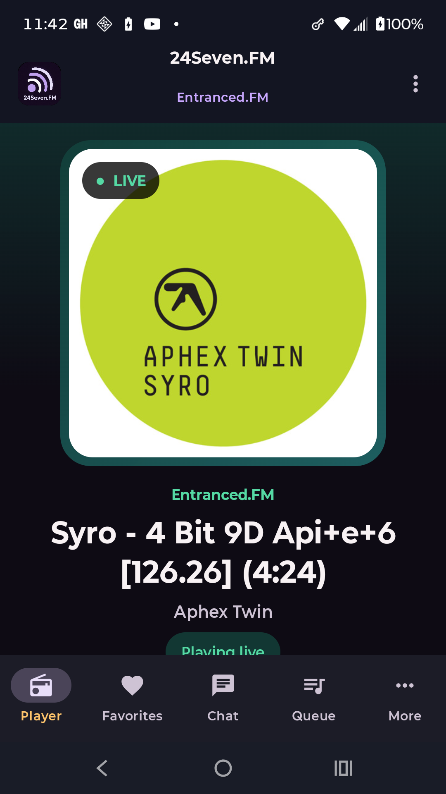<br><strong>M23 Compact Layout</strong><br><sub>Physical Razr evidence with live playback and bottom navigation.</sub></td>
    <td width="50%" align="center" valign="top">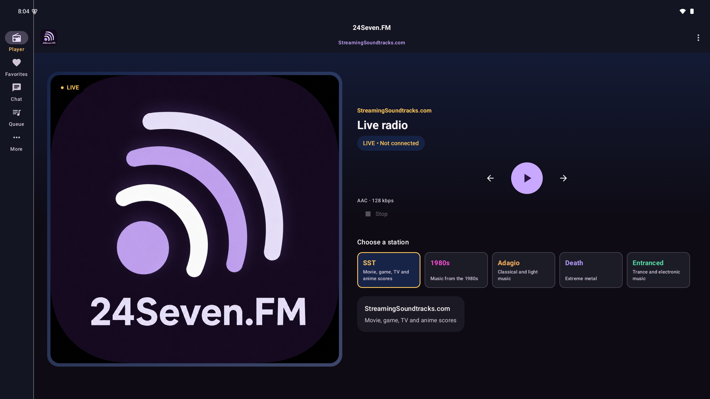<br><strong>M23 Expanded Layout</strong><br><sub>Landscape two-pane Player with navigation rail and station carousel.</sub></td>
  </tr>
  <tr>
    <td width="50%" align="center" valign="top">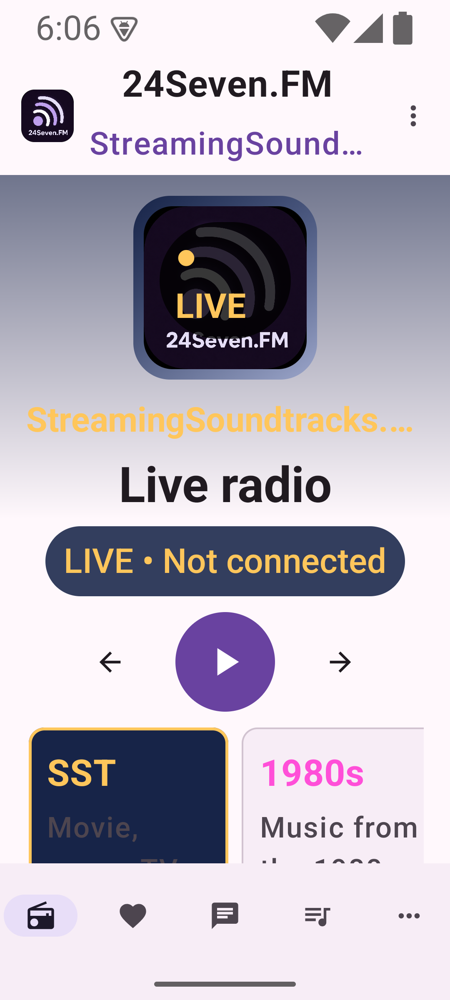<br><strong>M23 Large-Text Player</strong><br><sub>2× text and enlarged-display compact layout with reachable controls and station details.</sub></td>
    <td width="50%" align="center" valign="top">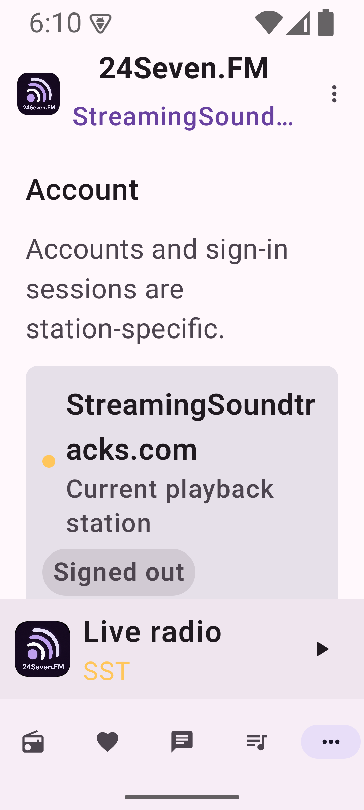<br><strong>M23 Large-Text Account</strong><br><sub>Account identity and status reflow instead of competing for one narrow row.</sub></td>
  </tr>
  <tr>
    <td width="50%" align="center" valign="top">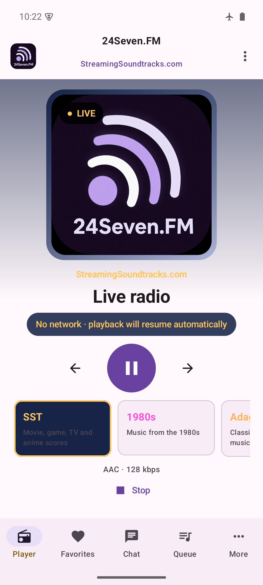<br><strong>M23 Offline State</strong><br><sub>Clear waiting status after both live-stream variants fail without connectivity.</sub></td>
    <td width="50%" align="center" valign="top">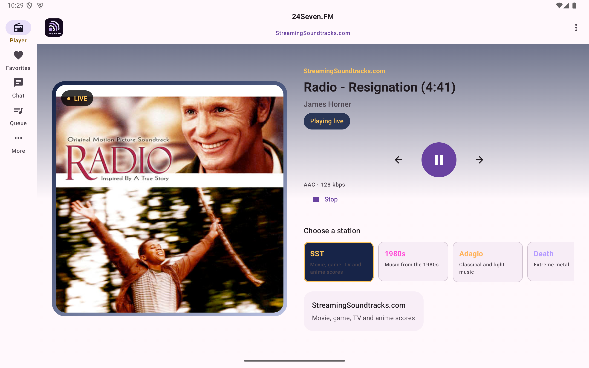<br><strong>M23 Automatic Recovery</strong><br><sub>Expanded Player returned to live playback after validated connectivity was restored.</sub></td>
  </tr>
  <tr>
    <td width="50%" align="center" valign="top">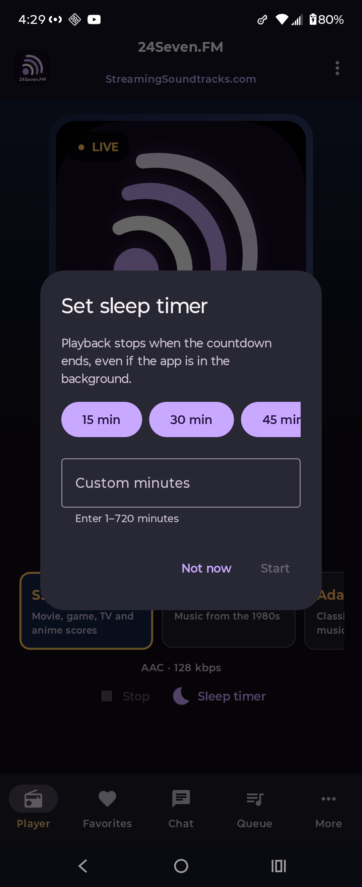<br><strong>M24 Timer Setup</strong><br><sub>Accessible presets and a bounded 1–720 minute custom duration.</sub></td>
    <td width="50%" align="center" valign="top">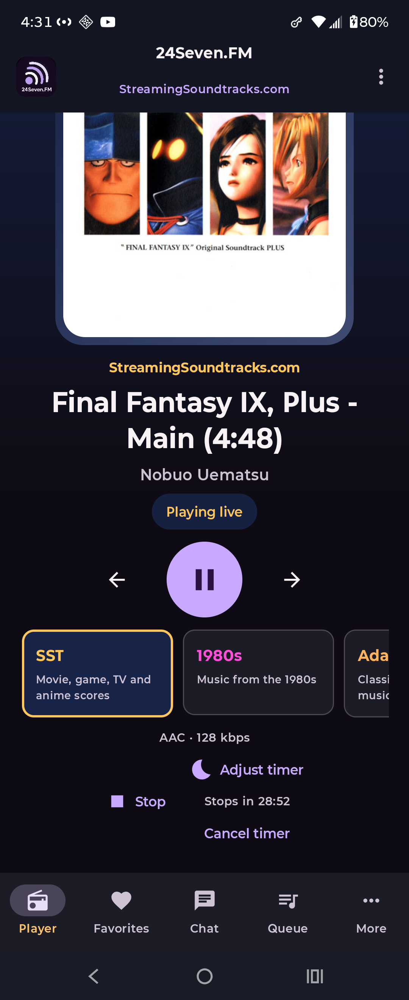<br><strong>M24 Active Countdown</strong><br><sub>Service-published remaining time during live playback.</sub></td>
  </tr>
  <tr>
    <td colspan="2" align="center" valign="top">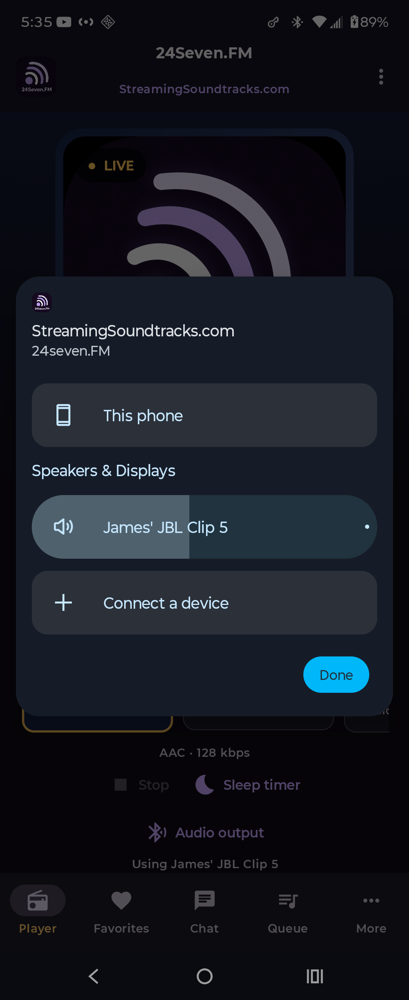<br><strong>M25 Audio-Output Handoff</strong><br><sub>Android System UI and the native Player agree on the active Bluetooth route.</sub></td>
  </tr>
</table>

Audio stream addresses come from station-provided playlists and remain subject to device verification. Remote interfaces are added only after source verification and permission review. See the milestone research and validation documents under [docs](docs) for authorization, protocol evidence, limits, and device results.

M17 tracks the native Private Messages experience, which remains deferred until the website's underlying server issues and production behavior are settled. See [docs/future-scope.md](docs/future-scope.md).

Alpha testers and distributors should read [the privacy notice](PRIVACY.md), [Alpha testing guide](docs/alpha-testing.md), [release notes](docs/releases/0.1.0-alpha01.md), [Play Console checklist](docs/play-console-checklist.md), and [M23 signing handoff](docs/m23-alpha-readiness.md). Development debug APKs are not intended for external distribution.

## Building

Open the repository in a current Android Studio release with JDK 17. The project targets and compiles against Android 16 (API 36), and is currently validated on the primary Motorola Razr 2023 running Android 16. It supports Android 8.0 (API 26) and newer.

From PowerShell, validate the project with:

```powershell
.\gradlew.bat testDebugUnitTest lintDebug assembleRelease
```

For an Ubuntu Codex CLI and Android Studio workstation, install the pinned
project toolchain, both API 35/API 36 emulators, and persistent `ANDROID_HOME`
configuration with:

```bash
bash scripts/bootstrap-ubuntu.sh --accept-licenses
```

The script also installs the ChatGPT Codex CLI. Authenticate afterward with
`codex login`, or use `codex login --device-auth` on a headless host. See the
[Ubuntu development setup](docs/ubuntu-cli-setup.md) for installed components,
options, security boundaries, and verification commands.

If the repository is inside a OneDrive-synced directory and Gradle stalls on file operations, direct app build outputs to a local directory before running Gradle:

```powershell
$env:TWENTYFOURSEVEN_ANDROID_BUILD_DIR="$env:TEMP\24seven-android-build"
```

See [CONTRIBUTING.md](CONTRIBUTING.md) before contributing.

For migration to another Windows development machine, clone the repository, install JDK 17 plus Android SDK Platform
36 and Build Tools 36.1.0, then run
`powershell.exe -NoProfile -ExecutionPolicy Bypass -File .\scripts\validate-windows.ps1`. The current Ubuntu workflow
is documented in the [Ubuntu development setup](docs/ubuntu-cli-setup.md).
