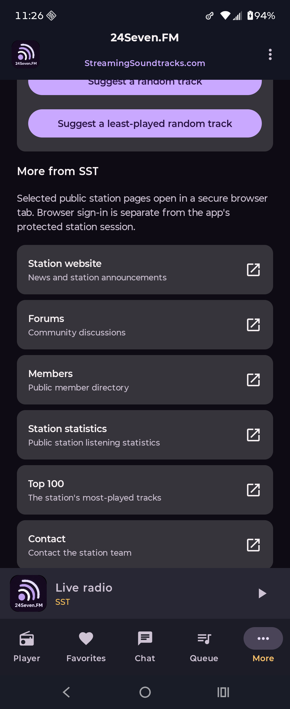

# M16 validation — secondary community and station content

Validated July 14, 2026 from implementation commit `90a7f98` on `agent/initial-android-scaffold`.

> Historical validation: M31 preserves this completed milestone but supersedes its shipping catalog. The current
> global Play candidate exposes only Contact through a reviewed Android email draft; membership, payment, registration,
> and other browser routes are absent pending their later authorization programs.

## Delivered behavior

- Added immutable station-page presentation models and a `supportsSecondaryContent` capability.
- Added an accessible native More-screen directory below the existing account/request surfaces, preserving their priority.
- Added exact public HTTPS routes for SST, 1980s.FM, Adagio.FM, and Entranced.FM, including the verified SST and 1980s-specific pages.
- Added an explicit unavailable state for Death.FM while its configured HTTPS origin cannot negotiate modern TLS.
- Added a pure trust policy that rejects unlisted, cross-origin, cleartext, credential-bearing, fragment-bearing, malformed, and nonstandard-port targets.
- Added lifecycle-safe Android Custom Tab launching with understandable no-browser/rejected-target handling. No WebView was introduced.

## Automated validation

The following incremental validators passed without `clean`:

```powershell
.\gradlew.bat :app:compileDebugKotlin
.\gradlew.bat :app:testDebugUnitTest
.\gradlew.bat :app:compileDebugAndroidTestKotlin
.\gradlew.bat :app:lintDebug
.\gradlew.bat :app:connectedDebugAndroidTest
.\gradlew.bat :app:installDebug
```

Coverage includes exact catalog membership, `www.` host normalization, capability gating, malicious URL rejection, four-station route availability, Death.FM unavailability, station-specific extras, accessible card semantics, explicit page action dispatch, and the unsupported-state presentation. The complete connected suite passed **21/21** tests on the wired Motorola Razr 2023 running Android 16.

## Physical evidence

The installed debug build rendered the SST secondary directory below the existing native request tools while retaining the persistent mini-player and navigation. Tapping **Station website** opened `com.android.chrome/...CustomTabActivity`; pressing Back returned to the native app. No form was submitted and no account data was involved.



## Known limits

- Custom Tabs use the browser's own cookies and privacy controls; the app's protected station session is deliberately not transferred.
- Death.FM has no M16 cards until its HTTPS origin is repaired and independently reverified.
- These legacy pages remain station-owned browser content. M16 does not promise native rendering, offline availability, or stability of content within them.
- Private Messages remains outside this directory and deferred as M47; existing native routes are never replaced by browser links.

## M20 follow-up — July 15, 2026

Death.FM's HTTPS service was repaired after M16. M20 independently reverified its seven exact public destinations,
including the station-specific `RIP_Subscribe` membership route, and enabled them without changing the M16 trust
policy. See [m21-death-certification.md](m21-death-certification.md). The original M16 validation result above is
retained as historical evidence.
