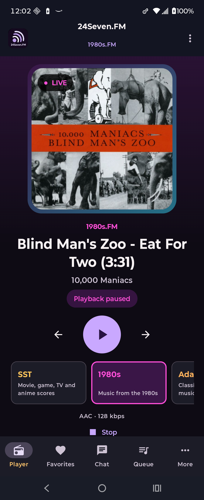

# M18 1980s.FM certification — complete

Public, device, and representative authenticated certification was performed July 14–15, 2026 on
`agent/initial-android-scaffold`.

## Task assessment

- Task Complexity Level: 2 — Feature Logic & API Integration
- T-shirt size: M
- Estimated active duration: 4–7 hours
- Primary confidence variable: resolved with a representative non-administrative account and user-entered CAPTCHA

## Completed public and device evidence

| Capability | Evidence | Current result |
| --- | --- | --- |
| Primary playback | The unchanged primary relay reached the native live-playing state on the wired Android 16 Razr with media volume temporarily muted | Pass |
| Source fallback | M02's controlled 1980s primary-only failure advanced Media3 to the unchanged source relay and reached `PLAYING` | Pass; not destructively repeated |
| Metadata/artwork | A fresh live run supplied a structured title, artist, same-station album cover, `LIVE`, selected 1980s styling, and AAC/128 kbps | Pass |
| Queue/History | The exact public extended endpoint returned HTTP 200, remained below the 512k bound, contained separate Queue and Played tables, and exposed 35 table rows; native `Up next` loaded without error under the 60-second limiter | Pass |
| Public Chat | Native 1980s Chat loaded without error and showed the correct signed-out posting boundary; the shared 30-second/memory-only behavior remains intact | Pass |
| Favorites boundary | Native Favorites is reachable and shows the station-qualified sign-in requirement without leaking another station's data | Pass |
| Request browsing | The native least-played suggestion returned album-track content and retained the signed-out submission boundary; no request was submitted | Pass |
| Authentication challenge | Native username/password fields, same-station CAPTCHA image, alphanumeric security-code field, sign-in action, and new-code action loaded without an error | Pass |
| Capability differences | Request messages and listener activity remain explicit `Not verified`; they do not inherit SST-only capability flags | Pass |
| Secondary pages at certification time | Historical Games/Awards and Membership browser evidence passed; later refinements removed those controls. M31 leaves only Contact in the global Play candidate. | Historical pass; Contact is current scope |
| Navigation/accessibility | Player, Favorites, Chat, Queue, and More remain present with station-qualified semantics and the persistent mini-player on secondary destinations | Pass |

No production Chat post, song request, profile change, membership action, or request mutation was performed. The only
account mutation was the explicit station-only logout required to verify session clearing. No credentials, CAPTCHA
value, cookie/session material, private response, participant content, or captured HTML was stored.

## Representative authenticated evidence

The user entered the credentials and alphanumeric CAPTCHA directly in the app. The resulting session was inspected
only through native state and behavior:

| Authentication behavior | Evidence | Result |
| --- | --- | --- |
| Successful sign-in | The account dashboard reported `1980s.FM account status: Signed in` and `Signed in as MorG`; no login error appeared | Pass |
| Protected restoration | A forced process stop changed the app PID; after relaunch the 1980s.FM session restored as MorG with no Android Keystore/decryption error | Pass |
| Station isolation | Entranced.FM Favorites remained signed out while the independent 1980s.FM account was signed in; no other visible account became authenticated | Pass |
| Favorites | With 1980s.FM selected, the signed-out gate disappeared and the authenticated filter loaded; the server returned a valid empty list for this account | Pass |
| Authenticated Chat | Public messages loaded with an enabled message field and Send action; no message was posted | Pass |
| Request eligibility | Least-played browsing returned *Torch* and one green requestable track with `Request Now`; no request was submitted | Pass |
| Capability restraint | Request messages and listener activity remained `Not verified`; no SST-only capability was inferred from authentication | Pass |
| Station-only logout | `Sign out of 1980s` cleared the account immediately; another process restart still showed `Load 1980s sign in`, MorG was absent, and other visible signed-in count remained zero | Pass |

Natural server-side expiration was not destructively induced. The shared expiration classifier remains covered by
automated repository/ViewModel tests, while the live gate proves successful restoration and explicit logout.

## Focused hardening

`BootstrapStationRepositoryTest` now locks the independently verified 1980s.FM capability contract:

- authentication, Chat, Favorites, Queue, History, requests, and trusted secondary content remain enabled;
- SST-only request messages and listener activity remain disabled;
- the certification-time HTTPS station catalog contained exact Contact and Membership entries; M31 later removed the
  Membership route, while historical Games/Awards routes also remain evidence only and are not shipped controls.

The focused unit test passes.

## Wired evidence

The physical run left playback paused and restored the original media volume. No fatal application exception was
observed. The screenshot records the live title and artwork after playback was paused; it contains no account data.

The authenticated account capture contains the public username only and no credentials, CAPTCHA, or session value:

## Certification limits

- No harmless Chat post or song request was needed to prove that authenticated actions became available, so no
  production content mutation was performed.
- 1980s.FM membership, personal request activity, and optional request-message behavior remain unavailable because
  reliable station-specific sources were not exposed by this ordinary account. They are explicit capability limits,
  not an incomplete authentication gate.
- M47 Private Messages remains outside M18 under the separate server-repair deferral.
