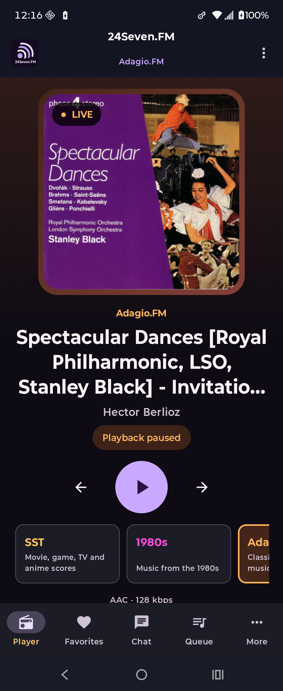

# M19 Adagio.FM certification — complete

Public, physical-device, and representative authenticated certification was completed July 15, 2026 on
`agent/initial-android-scaffold`.

## Task assessment

- Task Complexity Level: 2 — Feature Logic & API Integration
- T-shirt size: M
- Estimated active duration: 4–7 hours
- Primary confidence variable: resolved with a representative Adagio.FM account and user-entered CAPTCHA

## Completed public and device evidence

| Capability | Evidence | Current result |
| --- | --- | --- |
| Primary playback | The unchanged primary relay reached the native live-playing state on the wired Android 16 Razr with media volume temporarily muted | Pass |
| Source fallback | Both unchanged station-supplied relays delivered live audio bytes; the shared ordered Media3 fallback behavior remains covered by M02 and unit evidence | Pass without a destructive station-specific failure injection |
| Classical metadata/artwork | A fresh live run supplied composer plus the complete work/ensemble title, a same-station *Spectacular Dances* cover, `LIVE`, selected Adagio styling, and AAC/128 kbps | Pass; the raw ICY value remains preserved before presentation |
| Queue/History | The exact public extended endpoint returned HTTP 200, remained below the 512k bound, contained separate Queue and Played tables, and exposed 31 table rows; native `Up next` loaded classical rows without error under the 60-second limiter | Pass |
| Public Chat | Native Adagio Chat loaded current public messages without error and showed the correct signed-out posting boundary; the shared 30-second/memory-only behavior remains intact | Pass |
| Favorites boundary | Native Favorites is reachable and shows the Adagio-qualified sign-in requirement without leaking another station's data | Pass |
| Request browsing | The native least-played suggestion returned an album and track choices while retaining the signed-out submission boundary; no request was submitted | Pass |
| Authentication | Native username/password fields, same-station CAPTCHA image, alphanumeric security-code field, and new-code action loaded without error. A representative MorG session signed in, restored after a forced process restart without Keystore errors, remained isolated from the other stations, and cleared through explicit station-only logout across another restart. | Pass |
| Capability differences | Request messages and listener activity remain explicit `Not verified`; they do not inherit SST-only capability flags | Pass |
| Secondary pages | The trusted directory exposes the seven common Adagio pages; Forums opened at `adagio.fm` in a Chrome Custom Tab and Back returned to the native app | Pass |
| Navigation/accessibility | Player, Favorites, Chat, Queue, and More remain present with station-qualified semantics and the persistent mini-player on secondary destinations | Pass |

No production Chat post, song request, account mutation beyond sign-in/logout, or membership action was performed.
No credentials, CAPTCHA value, session material, private response, participant content, or captured HTML was stored.

## Representative authenticated evidence

| Check | Physical Razr result |
| --- | --- |
| Native sign-in | MorG signed in through Adagio.FM's own native username/password/alphanumeric-CAPTCHA form. |
| Protected restoration | A forced app stop/relaunch produced a new process and restored only the Adagio.FM session; no Android Keystore error was observed. |
| Station isolation | 1980s.FM, Death.FM, and Entranced.FM remained visibly signed out while Adagio.FM was signed in. |
| Favorites | The authenticated Adagio.FM Favorites surface loaded a valid empty list and retained its filter without an error. |
| Chat | The authenticated Adagio.FM Chat composer and Send action became available; no test message was needed or posted. |
| Requests | Least-played browsing returned one green requestable track and enabled `Request Now`; no request was submitted. |
| Logout | `Sign out of Adagio` cleared the station immediately. After another forced stop/relaunch, `Load Adagio sign in` remained visible and no station showed a signed-in identity. |

Natural server-side session expiry was not induced. The app's expiration classification remains covered by the
shared authentication implementation and tests; this certification used explicit logout to avoid waiting for or
artificially manipulating a production session.

## Focused hardening

`BootstrapStationRepositoryTest` now locks the independently verified Adagio.FM capability contract:

- authentication, Chat, Favorites, Queue, History, requests, and trusted secondary content remain enabled;
- SST-only request messages and listener activity remain disabled;
- the HTTPS station origin and exact seven-page common route set remain trusted catalog entries.

The focused unit test passes.

## Validation

- `:app:compileDebugKotlin` passed.
- All 107 debug unit tests passed.
- `:app:lintDebug` passed.
- All 21 connected instrumentation tests passed on the wired Android 16 Razr (128 total tests across both suites).
- The standalone debug APK was reinstalled after the connected-test harness and launched successfully.

## Physical-device evidence

The physical run left playback paused and restored the original media volume. No fatal application exception was
observed. The screenshot records the live classical title and same-station artwork after playback was paused; it
contains no account data.

The account screenshot shows the independent Adagio.FM session while the other visible station accounts remain
signed out. It contains only the administrator-approved test identity and no credentials, CAPTCHA, or session data.

## Certified limits

Adagio.FM request messages, listener request activity, and station membership remain explicitly `Not verified`.
They are not inferred from StreamingSoundtracks.com or similar page structure, and M19 introduced no capability
flag or production network mutation for them. Native Private Messages remain deferred under M47.
