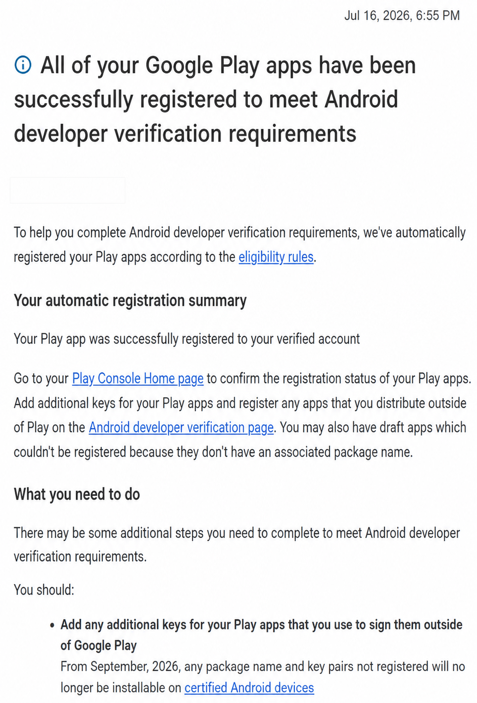

# M35 current-head release-candidate audit

Date: July 19, 2026

Status: complete; Sol accepted the protected Ubuntu signing path, exact upload identity, local Razr clean-install/update lineage, package registration, and version-code eligibility

## Outcome

The non-secret audit at commit `041a811` established the expected production identity, permissions, Media3 service
declaration, dependency set, license notices, backup exclusions, and 16 KB packaging. The protected Ubuntu helper then
built commit `2e43a2b`, the current code head at the time of this refresh, from the authenticated recovery package
without persisting signing material. Both artifacts match the registered Play upload certificate.

Google's July 16 account email confirms that the account's Play apps were automatically registered to the verified
developer account for Android developer verification. On July 19, the owner confirmed that the exact
`com.codeframe78.twentyfourseven.player` package is listed in that Play account as Draft and that its releases/bundles
catalog is empty. Together, those facts confirm the app's registration and that version code 2 remains unused and
eligible. No Console screenshot, identity, credential, or private account metadata is retained in Git.

Play-generated delivery, update, split inspection, and pre-launch evidence belong exclusively to M40 after M39 freezes
the exact candidate; they are not M35 completion gates. The established Windows DPAPI copy remains intact. Routine
signing can use the existing authenticated recovery package through the Linux helper without persisting a plaintext
keystore or credential file.

## Sol acceptance — July 19

M35 is complete from evidence commit `55413bd`. The accepted boundary includes the protected signing/recovery path,
the exact pinned upload certificate, signed AAB/APK verification, 16 KB packaging, physical Razr clean installation and
same-signer local update, automatic Play package registration, and unused version code 2. The release package remains a
pre-M39 signing checkpoint, not the frozen Alpha candidate. Actual upload, Play-generated splits, Play install/update,
and pre-launch remediation remain exclusively M40 work after M39.

## Android developer-verification evidence



*Sanitized owner-provided confirmation received July 16, 2026. The personalized greeting and surrounding browser,
mailbox, account, and desktop UI were removed before repository storage.*

The confirmation says that the account's Play apps were registered automatically and directs the owner to Play Console
Home for per-app status confirmation. It also distinguishes Play-distributed apps from apps signed and distributed
outside Google Play: any outside-Play package-and-key pair must be registered separately on the Android developer
verification page. No credential, signing material, private Console URL, or mailbox metadata is retained in this
evidence image.

## Release identity and manifest

| Field | Verified value |
| --- | --- |
| Application ID | `com.codeframe78.twentyfourseven.player` |
| App label | `24Seven.FM Player` |
| Version | `0.1.0-alpha01` / code 2 |
| SDK range | minimum 26, target 36 |
| Launcher | density-specific legacy plus adaptive and Android 13 monochrome resources |
| Service | `RadioPlaybackService`, exported Media3 session service, `mediaPlayback` foreground-service type |

The merged release manifest contains only the expected app permissions: Internet, network state, wake lock, Android
13+ notifications, foreground service, and foreground media playback. The build-generated dynamic-receiver permission
is signature-protected. The exported service and accepting `onGetSession` shape follow Media3's documented playback
service contract; Media3's default session callback limits untrusted controllers to read access.

`allowBackup="false"` is now reinforced by explicit Android 11-and-earlier full-backup rules and Android 12+ cloud and
device-transfer rules. Every app-private backup domain, including shared preferences that can hold protected station
session state and local safety preferences, is excluded.

## Historical unsigned local artifact evidence

| Artifact | Size | SHA-256 | Signing state |
| --- | ---: | --- | --- |
| `app-release.aab` | 17,489,217 bytes | `3ddf85453d423642a5b7a511cbaa6a0478a362112306836f05038b2e6fe9c2fd` | Intentionally unsigned |
| `app-release-unsigned.apk` | 17,967,922 bytes | `3ad68fdd18936620cdf4556805325ca488da9acb067e3a1be92f69958abe46c0` | Intentionally unsigned |

`jarsigner -verify -strict -verbose -certs` explicitly classified this earlier AAB as unsigned, which is the expected result when
the four `TWENTYFOURSEVEN_UPLOAD_*` values are absent. The textual classification is authoritative because `jarsigner`
can return exit code 0 for an unsigned JAR. These hashes identify only this local audit snapshot; the final protected
build has its own hash below.

## July 18 current-head protected refresh

| Artifact | Size | SHA-256 | Signing state |
| --- | ---: | --- | --- |
| `app-release.aab` | 18,821,803 bytes | `FA923DB3C7CC8C44661030F5DCCE594B0415C676A718E358E105ADD772483CB5` | Verified JAR signature; exact registered upload certificate |
| `app-release.apk` | 19,496,093 bytes | `D49FBD7454B8BBE4E58C2C3513074FA1370C22CDD9139DDB92CD28DBD928BA7A` | Verified APK Signature Scheme v2; exact registered upload certificate |

The authenticated recovery package matched its documented encrypted-package hash before use. The Linux signing tests
passed 8/8, the helper left no signing material in `/dev/shm`, and both outputs match upload-certificate SHA-256
`F6E8E81271964FFC3F8A0D548B49B4DB93AEFC48CCB74B8744512670F4279E3F`. The APK also passed Android's 16 KB ZIP
alignment verification.

The release APK was installed cleanly beside the debug package on the physical Android 16 Razr, cold-launched as
`0.1.0-alpha01` / version code 2, and verified through the native accessibility tree. Direct Play control reached
Media3 `PLAYING` state with live StreamingSoundtracks metadata, then paused correctly. Installing the exact same signed
APK again with `adb install -r` succeeded and preserved its first-install time while advancing its last-update time.
This proves local package identity and same-signer update behavior; it does not substitute for M40's Play-generated
delivery evidence. This refresh introduced no meaningful visual change and is not the M39-frozen final candidate.

## Historical July 16 protected signed checkpoint

| Artifact | Size | SHA-256 | Signing state |
| --- | ---: | --- | --- |
| `app-release.aab` | 17,506,034 bytes | `1C6C43BF947B844F5D8708DF368635CFE34B6A690DD826B87663B66C5C6C518F` | Verified JAR signature; exact registered upload certificate |
| `app-release.apk` | 17,980,210 bytes | `923C26621FC998CAA4D1099B7BCA5A118C7EB8256057D96E9971C4AFE29825D0` | Verified APK Signature Scheme v2; exact registered upload certificate |

Both artifacts use upload-certificate SHA-256
`F6E8E81271964FFC3F8A0D548B49B4DB93AEFC48CCB74B8744512670F4279E3F`. The Linux verifier intentionally does not
apply `jarsigner -strict` public-chain trust to the self-signed upload certificate; it requires a valid JAR signature and
then pins this exact certificate fingerprint. A regression test signs a synthetic bundle with a self-signed certificate
and exercises that path.

## 16 KB packaging

- Android `zipalign -c -P 16 -v 4` passed for the release APK.
- The AAB contains only `libandroidx.graphics.path.so`, for `arm64-v8a`, `armeabi-v7a`, `x86`, and `x86_64`.
- Every ELF `LOAD` segment in every ABI reports `0x4000` alignment.
- The established API 35 16 KB runtime suite also remains green; Play-generated split delivery remains an M40 gate.

## Dependencies and notices

The resolved release runtime was captured with Gradle. It contains AndroidX/Compose/Media3, Coil, OkHttp/Okio,
Kotlin/kotlinx, jsoup, Guava, Accompanist, JetBrains Compose transitive modules, annotations, jspecify, and Android core
library desugaring. It contains no advertising, analytics, crash-reporting, or developer-backend SDK.

The audited license families are:

- Apache License 2.0 for the AndroidX, Google, JetBrains, Kotlin, Coil, Square, and related support components;
- MIT for jsoup 1.22.2;
- GPLv2 with the Classpath Exception for `desugar_jdk_libs` 2.1.5; and
- Mozilla Public License 2.0 for the Public Suffix List data embedded by OkHttp.

The repository inventory and source links are in [`THIRD_PARTY_NOTICES.md`](../THIRD_PARTY_NOTICES.md). A bounded copy
is packaged as `res/raw/third_party_notices.txt` and is reachable natively from **More → Privacy → Open-source
licenses**. The upstream jsoup license and OkHttp Public Suffix List notice are also retained in the release AAB.

## Verification

- `:app:compileDebugKotlin` and `:app:compileDebugAndroidTestKotlin` — passed.
- `:app:testDebugUnitTest` — 132/132 passed.
- Focused `openSourceLicensesArePackagedAndReachableFromMore` on the API 35 Pixel Tablet — passed after final changes.
- `:app:lintDebug` — passed with 0 errors and 27 non-blocking warnings; the new resource-access and backup-rule
  warnings were resolved.
- `:app:connectedDebugAndroidTest` — 40/40 passed on the API 35 Pixel Tablet, including full 1,500-track Favorites
  traversal.
- Protected combined `:app:bundleRelease :app:assembleRelease` and release lint-vital — passed from current-head commit
  `2e43a2b`; the July 16 checkpoint from `2086ab9` remains historical evidence.
- Existing signed AAB verification — passed after correcting the verifier's self-signed-certificate trust semantics;
  exact upload-certificate fingerprint matched.
- Signed APK `apksigner verify --verbose --print-certs` — passed with APK Signature Scheme v2 and the exact same
  upload-certificate fingerprint.
- Linux protected-signing unit suite — 8/8 passed, including authenticated recovery, failure boundaries, SDK discovery,
  temporary cleanup/mode, and realistic self-signed bundle verification.
- Release APK 16 KB ZIP alignment — passed.
- AAB resource inspection — packaged license notice and both backup-rule resources present.
- Merged release manifest inspection — identity, target, permissions, launcher, backup, and service declarations passed.
- `git diff --check` — passed.

The remaining lint warnings are dependency-update advisories, documented MediaSession-service export, legacy/adaptive
launcher heuristics, test-only station playlist fixtures, and optional Kotlin convenience suggestions. None is a build
or Play-readiness error; dependency/toolchain upgrades remain intentionally outside this release audit.

## Protected completion procedure

From Ubuntu, first verify the non-secret prerequisites:

```bash
python3 scripts/validate-protected-play-bundle-linux.py --check-environment
```

Then, after confirming the intended commit and version-code availability, run the protected build from an interactive
terminal. Keep the encrypted package outside the repository and enter its passphrase only at the hidden prompt:

```bash
python3 scripts/validate-protected-play-bundle-linux.py \
  --recovery-package /absolute/path/outside-the-repository/24seven-upload.24seven-recovery \
  --build-apk
```

The helper authenticates the AES-256-GCM recovery envelope, verifies the embedded keystore hash and the exact registered
upload certificate, materializes the JKS only in memory-backed `/dev/shm`, launches a non-persistent Gradle process,
removes the temporary material, and verifies the signed AAB certificate. It prints only the resulting AAB hash and
certificate fingerprint. Eight focused tests cover success, wrong passphrase, wrong registered certificate,
mismatched keystore hash, repository-local package rejection, SDK discovery, temporary mode `600`/cleanup, and
self-signed upload-certificate verification.

The owner-controlled Windows DPAPI path remains a backup:

```powershell
powershell.exe -NoProfile -ExecutionPolicy Bypass `
  -File .\scripts\validate-protected-play-bundle.ps1 -BuildApk
```

The current AAB/APK hashes are recorded above and the AAB signer remains upload-certificate SHA-256
`F6E8E81271964FFC3F8A0D548B49B4DB93AEFC48CCB74B8744512670F4279E3F`. Supply no key path, alias, or password to Git,
chat, logs, or Play listing text. Then upload through the authorized test-track workflow and record Play's artifact
inspection, install result, and subsequent same-signing-lineage update result.
