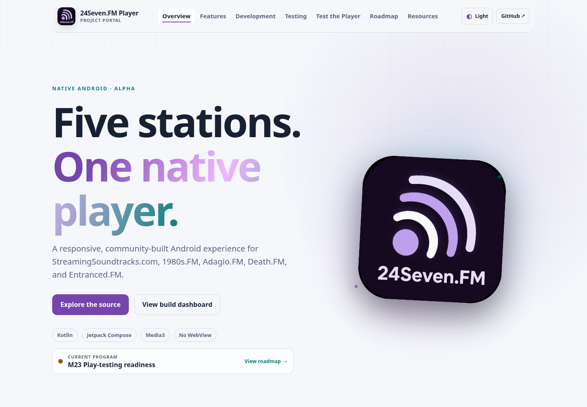
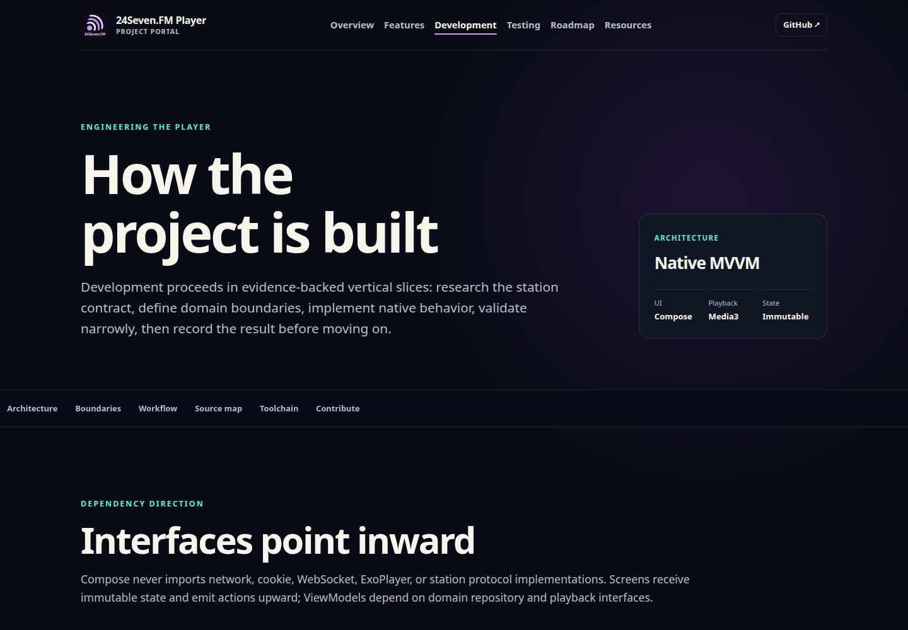
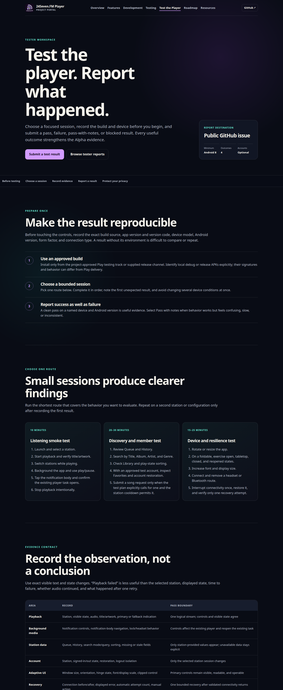
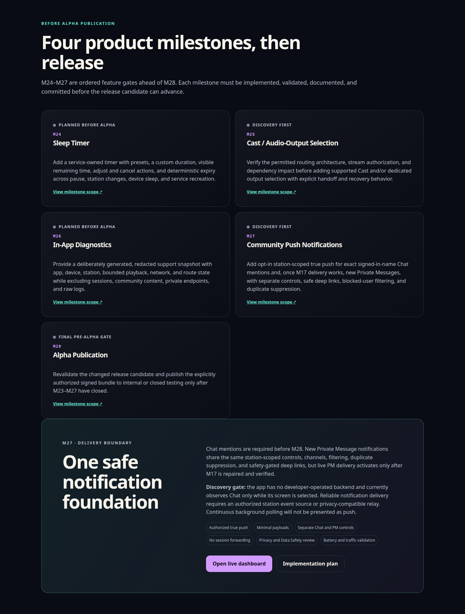

# Comprehensive project portal validation

Validated July 18, 2026.

## Outcome

The GitHub Pages surface now provides a comprehensive, responsive, interactive project portal while preserving the canonical privacy notice at the Pages root. Every destination shares the same visual shell, light and dark themes, compact mobile menu, scroll progress, active section navigation, copyable section links, reduced-motion support, ambient pointer feedback, and back-to-top control. A keyboard-accessible site explorer provides local search across all pages and the current page's sections from the floating Explore control, <kbd>/</kbd>, or <kbd>Ctrl</kbd>/<kbd>Cmd</kbd>+<kbd>K</kbd>. The portal includes:

- a product overview with an accessible screenshot lightbox and detailed feature/station boundaries;
- an interactive native architecture explorer, source organization, engineering principles, and milestone workflow;
- automated, emulator, physical-device, accessibility, network, performance, signing, and CI evidence with copyable commands and inspectable table rows;
- a tester-facing 38-case product workspace with local search, status filters, device-only checklist progress, bounded smoke/member/device/resilience/adaptive sessions, dedicated M29/M31 policy cases, future VIP/RIP commerce lifecycle cases, and a structured public result form for passes, failures, notes, and blocked tests;
- all 32 achieved checkpoints in verified chronological order, including completed M24 Sleep Timer, M25 Audio-Output Selection, M26 In-App Diagnostics, M27 local Chat mentions, M28 UGC safety, M31 payments/account-route compliance, M32 security, M33 request integrity, and M35 signing/Console eligibility;
- the three remaining M29–M35 Alpha-readiness gates, completed M31–M33/M35, deferred M47 boundary, M36–M38 closed-app delivery gates, and M39–M41 Alpha-delivery program;
- a searchable, category-filtered public resource index for architecture, protocol research, station certification, Play readiness, release notes, testing, and contribution;
- a searchable privacy notice with a generated on-page table of contents while keeping all canonical notice text visible without JavaScript.

Repeated navigation and milestone history are generated from `privacy-site/_data/project.yml`. Interactive enhancements are progressive: navigation, privacy content, architecture text, resource links, tester cases, and screenshot links remain usable when JavaScript is unavailable. The existing `PRIVACY.md` generation and `/` permalink remain authoritative.

## Verification

- Official `ghcr.io/actions/jekyll-build-pages:v1.0.13` container: pass.
- Eight generated HTML pages, including the root privacy notice: pass.
- Internal page, asset, and fragment link contract: pass.
- Liquid rendering and active navigation markers in both the shared header and site explorer: pass.
- JavaScript syntax, no-JavaScript fallback, and progressive-enhancement contract: pass.
- Workflow/data YAML parsing and 29-entry chronological milestone contract: pass.
- Chromium review at 1440 px and 390 px with no horizontal overflow: pass.
- Theme selection and persistence, mobile navigation, site explorer search/keyboard controls, privacy search/table of contents, architecture exploration, command copying, tester checklist/filtering, roadmap filtering, resource filtering, inspectable tables, and screenshot lightboxes: pass.
- All interactive checks completed with no uncaught browser exceptions or console errors: pass.
- Product-testing issue-form YAML with 17 blocks and 16 unique field IDs: pass.
- Roadmap review through M60, including the reordered M24–M41 sequence and M58–M60 commerce program: pass.
- All local stylesheets, scripts, icons, and screenshots resolved with no missing assets.
- `git diff --check`: pass.

The M31 synchronization removes station browser/purchase cards, updates explanatory text in the native privacy notice,
and extends the nonblocking roadmap/testing catalog for future authorized commerce. It does not alter playback,
station network traffic, permissions, signing material, or protected-session behavior.

## Visual evidence

<table>
  <tr>
    <td width="50%" align="center" valign="top"> <strong>Privacy notice</strong> Canonical privacy content with local search and generated section navigation.</td>
    <td width="50%" align="center" valign="top"> <strong>Project overview</strong> Current status, project entry points, station scope, and interactive screenshot gallery.</td>
  </tr>
  <tr>
    <td width="50%" align="center" valign="top"> <strong>Feature catalog</strong> Native playback, discovery, accounts, community safeguards, and station boundaries.</td>
    <td width="50%" align="center" valign="top"> <strong>Development process</strong> Architecture explorer, principles, milestone lifecycle, source map, and toolchain.</td>
  </tr>
  <tr>
    <td width="50%" align="center" valign="top"> <strong>Engineering validation</strong> Current checks, device coverage, copyable commands, specialized evidence, and release gates.</td>
    <td width="50%" align="center" valign="top"> <strong>Product testing workspace</strong> Local-only progress, scannable acceptance cases, and reproducible public result reporting.</td>
  </tr>
  <tr>
    <td width="50%" align="center" valign="top"> <strong>Pre-Alpha roadmap</strong> Search and status controls expose the seven release gates, achieved history, and future milestones.</td>
    <td width="50%" align="center" valign="top"> <strong>Resource library</strong> Thirty-two public architecture, station, testing, release, and contribution resources.</td>
  </tr>
</table>
